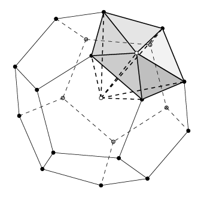
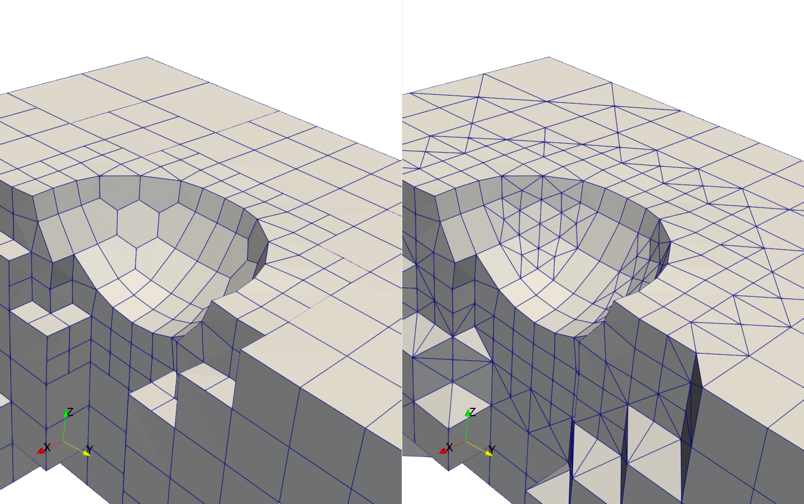
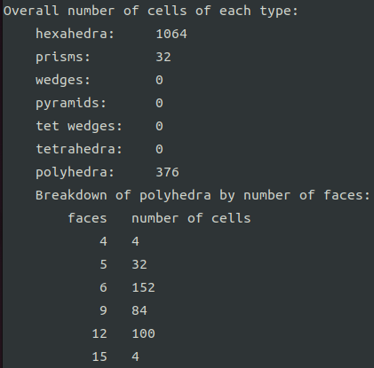
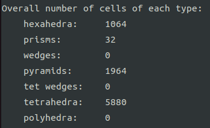

# splitPolyFoam

#### 介绍
基于OpenFOAM开发的多面体单元分割程序，用于将多边形面分解为三角形和将多面体单元分解为金字塔单元和四面体单元，从而使计算网格由六面体，四面体，四棱锥（金字塔）和三棱柱四种类型单元组成。

##### 示意图

首先对计算网格中的多边形面增加几何中心点将其分割为三角形。之后对每个单元类型进行判断如果当前单元不是六面体，四面体，四棱锥（金字塔）和三棱柱四种类型中的一种，则认为其为多面体，增加体心点并以此为顶点，单元面为底面将其分割为四棱锥（金字塔）和四面体单元。



##### 测试结果

在`OpenFOAM`中使用`blockMesh`和`SnappyHexMesh`网格划分工具对一个曲面几何划分，左图在边界处出现了多边形和多面体。切分程序执行后，多面体将被分割。




使用`checkMesh`检查网格，切分前：存在376个多面体单元，其中最多的为十五面体；切分后：多面体单元被分解为了金字塔和四面体单元。





#### 程序组成

```shell
.
├── splitCellsFoam
│   ├── createTopoMesh.H
│   ├── Make
│   │   ├── files
│   │   └── options
│   ├── MYcellSplitter.C
│   ├── MYcellSplitter.H
│   └── splitCellsFoam.C
└── splitFacesFoam
    ├── Make
    │   ├── files
    │   └── options
    └── splitFacesFoam.C
```

#### 安装教程

编译前准备：`OpenFOAM-v1912`

1. 进入求解器目录

   ```shell
   $ sol
   ```

2. 下载代码到本地

   ```shell
   $ git clone https://gitee.com/jiangxuhao/split-poly-foam
   ```

3. 进入`splitFacesFoam`并编译

   ```shell
   $ cd split-poly-foam/splitFacesFoam && wmake
   ```

4. 进入`splitCellsFoam`并编译

   ```shell
   $ cd split-poly-foam/splitCellsFoam && wmake
   ```

#### 使用说明

1. 串行：`Allrun`

   ```shell
   #!/bin/sh
   cd "${0%/*}" || exit                                
   . ${WM_PROJECT_DIR:?}/bin/tools/RunFunctions        
   #-------------------------------------------
   
   runApplication splitFacesFoam -overwrite
   runApplication splitCellsFoam -overwrite
   runApplication checkMesh
   ```
   
2. 并行：`Allrun`

   ```shell
   #!/bin/sh
   cd "${0%/*}" || exit                                
   . ${WM_PROJECT_DIR:?}/bin/tools/RunFunctions        
   #-------------------------------------------
   
   runApplication decomposePar
   runParallel splitFacesFoam -overwrite
   runParallel splitCellsFoam -overwrite
   runParallel checkMesh
   ```
